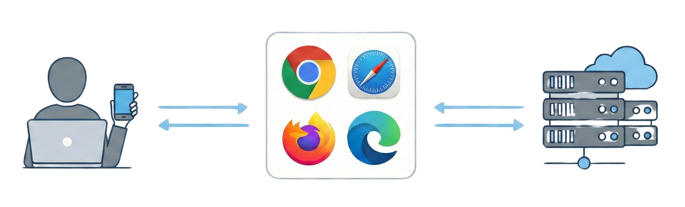

% Modern Web Browsers
% Sable Cantus

<section data-background-image="img/browsers.png"
         data-background-size="contain"
         data-background-position="center"
         data-background-repeat="no-repeat">
</section>

---

## What is a Web Browser?

A **web browser** is a software application designed for:

- Accessing and retrieving content from the World Wide Web
- Interpreting HTML, CSS, and JavaScript
- Displaying formatted web pages to users
- Serving as the primary gateway to internet resources

---

Browsers act as intermediaries between users and web servers

---

## Core Browser Functions

---

### Content Management

- **Content Retrieval**: Send HTTP/HTTPS requests to web servers
- **Content Rendering**: Parse and display HTML, CSS, JavaScript
- **User Interaction**: Handle clicks, form submissions, navigation

---

### Security & Data

- **Security Management**: Protect users from malicious content
- **Data Storage**: Manage cookies, cache, browsing history

---

## Browser Architecture

---

<!-- ### Seven Main Components: -->

1. **User Interface** - Address bar, navigation buttons, tabs
2. **Browser Engine** - Bridge between UI and rendering engine
3. **Rendering Engine** - Displays web content (Blink, WebKit, Gecko)
4. **JavaScript Engine** - Executes interactive code (V8, SpiderMonkey)
5. **Networking** - Handles HTTP/HTTPS communications
6. **UI Backend** - Draws interface elements
7. **Data Storage** - Manages local data

---

## Popular Rendering Engines

| Browser | Rendering Engine | JavaScript Engine |
|---------|------------------|-------------------|
| Chrome | Blink | V8 |
| Firefox | Gecko | SpiderMonkey |
| Safari | WebKit | JavaScriptCore |
| Edge | Blink | V8 |
| Opera | Blink | V8 |

---

## Key Browser Features

---

### Navigation & Browsing

- **Tabbed Browsing** - Multiple pages in one window
- **Address Bar Integration** - URL entry + search functionality
- **Bookmarks** - Save and organize favorite sites
- **Browsing History** - Track visited websites
- **Download Manager** - Manage file downloads

---

## Privacy & Security Features

---

### Privacy Protection

- **Private/Incognito Mode** - Browse without saving data locally
- **Enhanced Tracking Protection** - Block cross-site trackers
- **HTTPS Enforcement** - Prioritize secure connections

---

### Security Measures

- **Pop-up Blockers** - Prevent unwanted advertisements
- **Safe Browsing Protection** - Warn about malicious sites
- **Automatic Updates** - Patch security vulnerabilities quickly

---

## Productivity Features

---

### User Convenience

- **Password Management** - Generate and store secure passwords
- **Form Autofill** - Automatically complete common information
- **Synchronization** - Access data across multiple devices

---

### Developer Tools

- **Developer Console** - Debug and inspect web pages
- **Network Analysis** - Monitor website performance
- **Element Inspection** - Examine HTML/CSS structure

---

## Popular Modern Browsers

---

### Google Chrome
- Most widely used globally
- Fast performance and Google integration
- Extensive extension ecosystem

---

### Mozilla Firefox
- Open-source with strong privacy focus
- Customizable interface
- Enhanced tracking protection

---

### Safari
- Apple's native browser for Mac/iOS
- Excellent energy efficiency
- WebKit rendering engine

---

### Microsoft Edge
- Microsoft's modern browser replacement for IE
- Chromium-based with AI integration
- Enhanced security features

---

### Opera
- Unique features: built-in VPN, ad blocker
- Gaming-focused version (Opera GX)
- Productivity tools integrated

---

## What are Browser Extensions?

**Browser Extensions** are small software programs that:

- Customize and enhance browser functionality
- Modify user interfaces and website behavior
- Add new features not built into the browser
- Integrate third-party services

::: notes

**Built using**: HTML, CSS, JavaScript + browser APIs

:::

---

## Popular Extension Types

---

### Security & Privacy

- **Ad Blockers**: uBlock Origin, Adblock Plus
- **Password Managers**: Bitwarden, LastPass
- **VPN Extensions**: ExpressVPN, NordVPN*

::: notes

Be careful of the thousands of fake VPN extensions

:::

---

### Productivity

- **Writing Tools**: Grammarly, LanguageTool
- **Task Management**: Todoist, Notion Web Clipper
- **Screenshot Tools**: Awesome Screenshot, Lightshot

---

## How Extensions Work

---

### Technical Components

- **Content Scripts** - Modify web page content and behavior
- **Background Scripts** - Run continuously for browser events
- **Popup Interfaces** - Quick access to extension features
- **Options Pages** - Configure extension settings

---

### Installation Sources

- Chrome Web Store
- Firefox Add-ons
- Microsoft Edge Add-ons
- Safari Extensions (Mac App Store)

---

## Extension Security

---

### Best Practices

- **Install from official stores only**
- **Review permissions carefully**
- **Check developer reputation**
- **Read user ratings and reviews**
- **Regular audits of installed extensions**

---

### Security Risks

- **Excessive permissions requests**
- **Unknown or suspicious developers**
- **Extensions from unofficial sources**

---

## Advanced Security Features

### Modern Protection Methods

- **Sandboxing** - Isolate web content in secure containers
- **Site Isolation** - Each website runs in separate processes
- **Certificate Validation** - Verify SSL/TLS certificates
- **Content Security Policy** - Prevent XSS attacks

---

### Automatic Safety
- **Real-time malware detection**
- **Phishing site warnings**
- **Mixed content blocking**

---

## Which Browser Should I Use?

---

### Consider Your Priorities:

---

**Privacy-Focused**

- Firefox with strict tracking protection
- Brave with built-in ad blocking
- Safari with intelligent tracking prevention

---

**Performance-Oriented**

- Chrome for speed and compatibility
- Edge for Windows integration
- Opera for built-in features

---

## Browser Selection Criteria

---

### Key Factors to Evaluate:

1. **Privacy Requirements** - Level of tracking protection needed
2. **Performance Needs** - Speed and resource usage
3. **Feature Preferences** - Built-in tools and capabilities
4. **Platform Compatibility** - Device and OS support
5. **Extension Ecosystem** - Availability of needed add-ons
6. **Synchronization** - Cross-device data sharing

---

## The Future of Web Browsing

---

### Emerging Trends

- **AI Integration** - Smart assistance and automation
- **Enhanced Privacy** - Stronger default protections
- **Performance Optimization** - Faster rendering and loading
- **Progressive Web Apps** - Bridging web and native apps

---

### Continued Evolution

- Better security measures
- Improved accessibility features
- Enhanced developer tools
- Cross-platform consistency

---

## Key Takeaways

---

### Remember:

1. **Browsers are sophisticated software** with complex architectures
2. **Security and privacy features** are increasingly important
3. **Extensions dramatically expand functionality** but require careful selection
4. **Different browsers serve different needs** - choose based on priorities
5. **Regular updates** are crucial for security and performance

---

**Topics for Discussion:**

- Which browser features matter most to you?
- How can you determine if it's safe to install an extension?
- What privacy settings do you prioritize?

---

### Thank you!

--- 

### Learn More:

- [MDN Web Docs](https://developer.mozilla.org/en-US/docs/Learn/Getting_started_with_the_web/How_the_Web_works): How the Web Works
- [WebExtensions API](https://developer.mozilla.org/en-US/docs/Mozilla/Add-ons/WebExtensions): Extension development
- [Chrome DevTools](https://developer.chrome.com/docs/devtools/): Developer documentation
- [Firefox Privacy](https://www.mozilla.org/en-US/firefox/privacy/): Enhanced protection features
